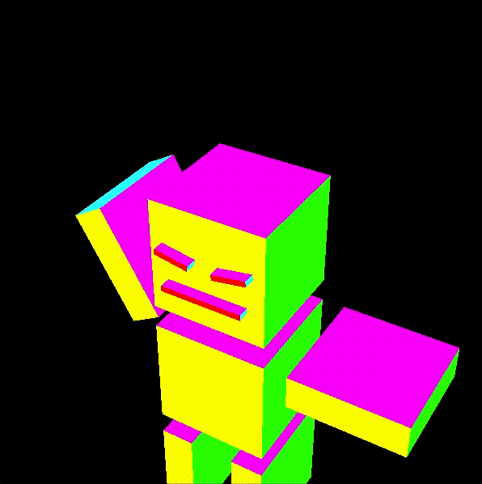
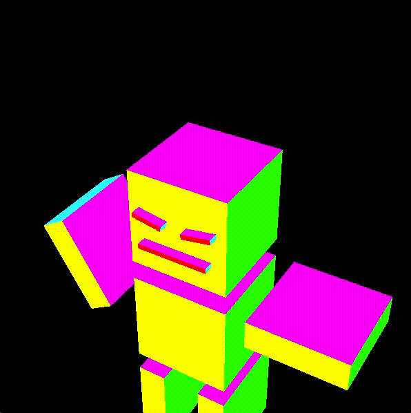
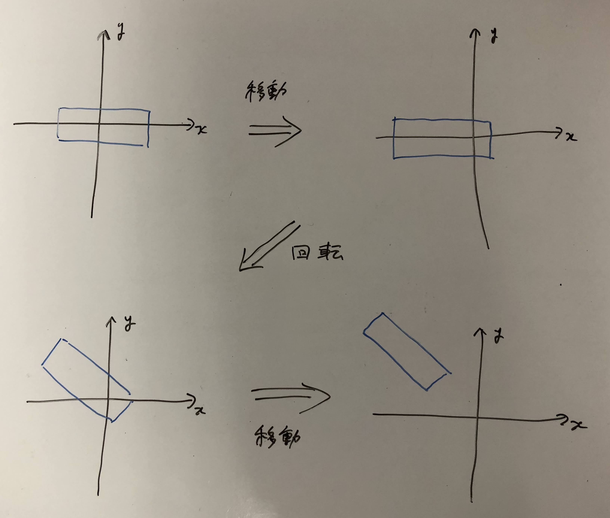

この資料は、従来版の第4回 - アニメーション に対応します。
[このリポジトリ](https://github.com/trnciii/ciesample-animation)からファイルをダウンロードしたら`sample.xcodeproj` を開き、実行できるか確認してください。

## 目次
* [準備](#準備)
* [プログラムの概要](#プログラムの概要)
    * [メインループ](#メインループ)
    * [描画内容](#描画内容)
* [課題1](#課題1)
* [ロボットを回そう](#ロボットを回そう)
* [ロボットのパーツを動かす](#ロボットのパーツを動かす)
* [課題2](#課題2)
* [課題3](#課題3)


## 準備
ここのコードをダウンロード、解凍してください。sample.xcodeproj を開き実行すると回転する立方体が表示されることを確認してください。


## プログラムの概要
このプログラムでは時間(フレーム)を使ったアニメーションを行なっています。メインループでフレーム数の更新を行ない、`display(int frame)`関数は与えられたフレーム数に応じた描画を行います。

### メインループ
main関数の中では変数`frame`がフレーム数を覚えておくために使われています。ループ処理ごとにフレーム数が増加していき、フレーム数の上限である`MAXFRAME`まで進むと0に戻ることをずっと繰り返しています。`MAXFRAME`は7行目に定義されており、main.cpp の中で使うことができます。

[ main.cpp ]
```cpp
// 省略

#define MAXFRAME 300.0

// 省略

int main(void)
{
    // 省略

    int frame = 0; // フレーム数の変数
    do{
        // フレーム数の更新
        // frame は1ずつ増加していき、MAXFRAMEまでいくと0に戻ることを繰り返す
        frame++;
        if(MAXFRAME < frame)
            frame = 0;

        // frame を引数として描画をおこなう
        display(frame);

        glfwSwapBuffers(window);
        glfwPollEvents();
    }while( !glfwWindowShouldClose(window) );

   glfwTerminate();

    return 0;
}
```

### 描画内容

それでは`display(int frame)`を見てみましょう。この中でフレームごとに少しずつ異なる画面を描画することでアニメーションの表現ができます。

[ main.cpp ]
```cpp
void display(int frame)
{
    glClear(GL_COLOR_BUFFER_BIT | GL_DEPTH_BUFFER_BIT);

    glMatrixMode(GL_MODELVIEW);
    glLoadIdentity();
    
    double angle = (double)360*frame/MAXFRAME; // frame から回転角を決める。MAXFRAME で一回転。
    glRotated(angle,0,0,1); // z軸回転させる
    makebox(1.0,1.0,1.0);
}
```
具体的にアニメーション（箱の回転）をしているのは、`glRotated(angle,0,0,1)`の部分です。 今までと違い、回転量が定数ではなく`frame`を元にした`angle`という変数になっています。`frame`の値が刻々と変わるので、箱が回転します。

## 課題1
以下の処理をさせてください。

1. ボックスが左右に往復するようにしてください。
2. ボックスを２つ描き、片方が一回転する間に、もう片方は二回転するようにしてください。
3. 斜め上方に放出された小さなボックスが放物線を描いて落下るような動きを作ってみてください。(割と難)<details><summary>ヒント</summary>初速度を与え、y軸方向(鉛直方向)に重力加速度に従って落下させます。つまり、y座標が時間の二次関数になります。なお単位は適当でいいです。</details>
4. たくさんの微小ボックスを爆発的に飛ばし、自由落下させてください。(かなり難)<details><summary>ヒント</summary>たくさんのボックスの位置を記録しておくため、配列を用いましょう。あとはそれぞれのボックス位置を更新してあげればいいです。初速度はランダムに決めるとやりやすいです。</details>


## ロボットを回そう
前回の授業でロボットをつくりました。これを今度は動かしてみましょう。ボックスが回転するサンプルを改造していきます。(課題1でプログラムを書き換えた人は再度サンプルファイルをダウンロードしてください)

まず`makebox()`と同じようにロボットを表示する関数を作りましょう。box.hpp とbox.cpp に`drawRobot()`という関数を追記していきます。

[ box.hpp ]
```cpp
#pragma once
#include "GLFW/glfw3.h"

void makebox(double width, double height, double length, GLenum type=GL_LINE_LOOP);

void drawRobot(); //追加

```

[ box.cpp ]
```cpp

#include "box.hpp"

void makebox(double width, double height, double length, GLenum type)
{
   // 省略
}

// 追加
void drawRobot()
{
    // ロボットをここに書く
}
```

最後に、main.cpp内の`draw(int frame)`で呼び出している`makebox`を`drawRobot`に書き換えます。プログラムを実行すると、前回で作ったロボットが描画されていると思います。

## ロボットのパーツを動かす
今はロボットの全身がぐるぐると回っています。体のパーツごとに動きをつけてみましょう。
変数`angle`を`drawRobot`に渡すようにプログラムを変更して腕を振らせてみます。



まず、`drawRobot`関数に引数をつくります。box.hpp, box.cpp 内でそれぞれ

[ box.hpp, box.cpp ]
```cpp
void drawRobot()
```
↓
```cpp
void drawRobot(double angle)
```
のように書き換えます。また、main.cpp での呼び出しを`drawRobot(angle)`と書き換えます。

あとは変数`angle`を使ってロボットの姿勢を変えるだけです。ロボットの腕を作っている`makebox`のすぐ上に`glRotated`を追記します。

[ box.cpp ]
```cpp
glPushMatrix();  //-- 右腕
    glTranslated(-1.2, 0.35, 0);
    glRotated(60*sin(2*M_PI*angle/180), 0, 0.0, 1.0);// 追加
    makebox(1, 0.3, 1, GL_POLYGON);
glPopMatrix();
```
`glRotated`引数は左から順に(角度, 軸のx成分, 軸のy成分, 軸のz成分)でした。<br>
回転角について、angle は0度から360度までをぐるぐる回っていますが、sin関数はラジアンでの入力なので適当に変換します。また、腕を降る振幅は上下60度くらいにしてみました。

`60*sin(2*M_PI*angle/180)`

回転の軸はz軸(奥行き方向)としたいので、各成分は順に(0,0,1)としました。<br>
この状態で実行してみると、だいたいこのような動きになるのではないでしょうか。



現在の設定では、ロボットの腕を回すとき、腕を作っているボックスのちょうど真中を中心にして回転してしまいます。本当は、ロボットの腕の付け根を中心にして回って欲しいので、`glTranslated`をうまく利用します。

[ box.cpp ]
```cpp
glPushMatrix();  //-- 右腕
    glTranslated(-0.5, 0.35, 0); // 3. 右肩の位置まで移動
    glRotated(60*sin(2*M_PI*angle/180), 0, 0.0, 1.0); // 2. 原点を中心に腕を振る
    glTranslated(-0.7, 0, 0); // 1. 原点が回転の中心となるよう移動
    makebox(1, 0.3, 1, GL_POLYGON);
glPopMatrix();
```
「移動させてから（原点中心に）回転」と、「（原点中心に）回転させてから移動」とは結果はかなり異なったものになり、組み合わせ方が重要になってきます。OpenGLの場合、変換後に書いたほうから順に行われるのでした。下から順にどのような変換を行なっているかをみてみると、次のようになっています。また、ロボットの正面からみた右腕は、図のように変換されています。

1. まず腕の回転の中心を原点に持ってくるように移動
2. (原点を中心に)腕の回転
3. 回転した腕を右肩の位置まで移動



## 課題2
次の手順でロボットを歩かせてみましょう。

1. 左右の脚を交互に前後させてください。
2. 腕の振りを加えてください。
3. 全身の上下動作を加えてください。

難しいという人は、従来の資料のほうにサンプルがあるので参考にしてください。(すみませんがまだ移植できてません。関数のコピペ動くと思いますが...)

## 課題3
さらに発展した動きとして次のようなアニメーションを作ってください。

* ロボットを踊(躍)らせて下さい。腕や足、全身を回転・移動させることで楽しい動きを工夫してください。歩く、走る、跳ぶ、踊る、体操する、その他、何でもＯＫです。
* 複数の動きを連続的に組み合わせて、ちょっと長めのアニメーションを作ってみてください。
* 異なる形の二体のロボットを別々に動かしてみてください。(やや難)

すべてクリアするのは大変とは思いますが、できる範囲で頑張ってみてください。また、完成した映像をslackのほうに共有してもらえると嬉しいです。
